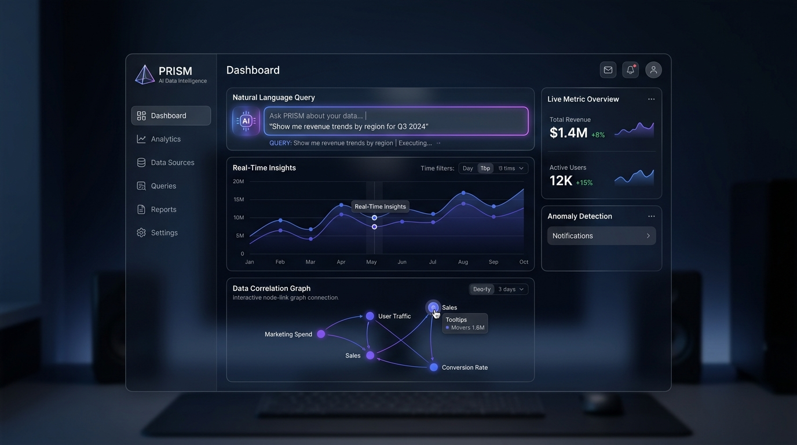
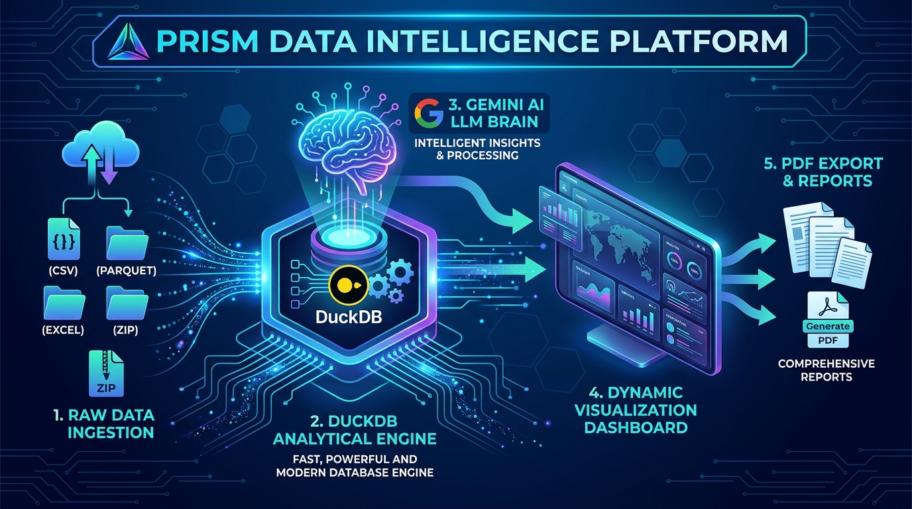
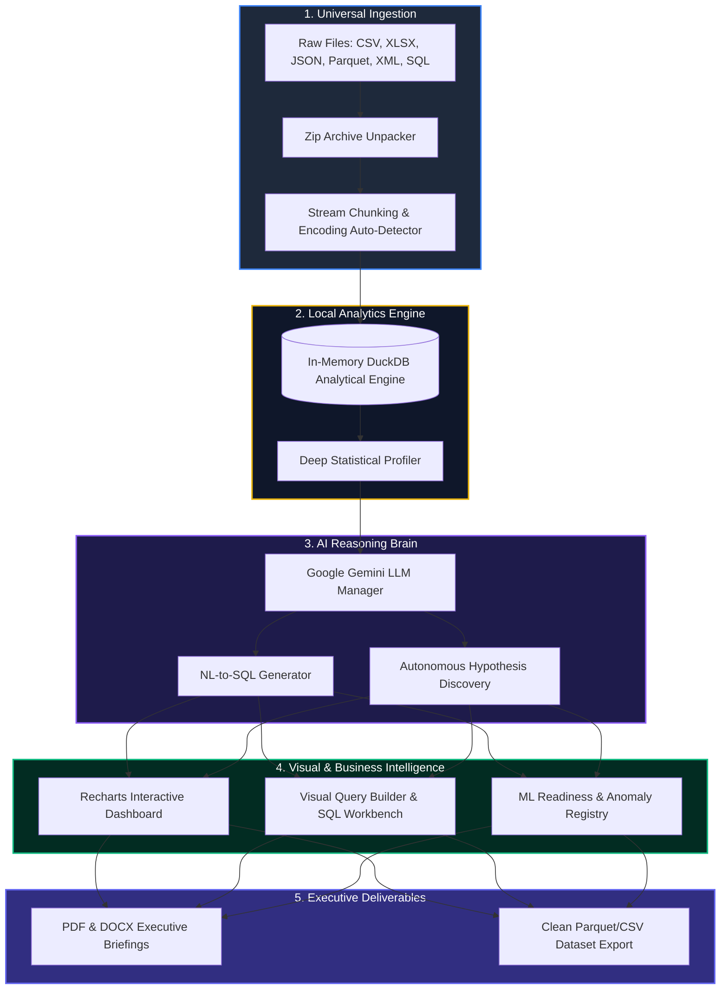

<div align="center">

# ⚡ PRISM — Autonomous AI Data Intelligence Platform

### *Your Local-First, Zero-Setup AI Data Analyst*

**Stop writing repetitive Pandas boilerplate. Stop struggling with complex SQL joins. Stop paying cloud BI fees.**

[](https://www.python.org/)
[](https://fastapi.tiangolo.com/)
[](https://reactjs.org/)
[](https://www.typescriptlang.org/)
[](https://duckdb.org/)
[](https://ai.google.dev/)
[](#-privacy--security-manifesto)

<br/>



</div>

---

## 🌟 Why PRISM Stands Apart

Traditional data analysis is broken: you spend 80% of your time cleaning corrupted CSVs, configuring virtual environments, and fighting database drivers—only to expose your company's sensitive records to third-party cloud servers.

**PRISM flips the script.** 

It is a **local-first, ultra-fast Data Intelligence Platform** that acts as an autonomous AI Data Analyst running straight from your machine. Drop in any raw dataset—no matter how messy, fractured, or unformatted—and PRISM automatically detects schemas, repairs corrupt records, discovers hidden causal correlations, generates interactive Power BI-style dashboards, and answers your plain-English questions with hyper-optimized SQL.

> [!IMPORTANT]
> **🛡️ 100% Privacy-First Architecture**  
> Your raw dataset rows **NEVER leave your local machine**. PRISM executes all data processing locally via an in-memory DuckDB engine. Only lightweight schema definitions (column names and data types) are sent to the AI for reasoning.

---

## 📐 System Architecture & Data Pipeline

PRISM combines high-throughput data engineering with modern generative AI reasoning:



### 🔄 End-to-End Execution Flow



---

## 🔥 Unrivaled Feature Suite

### 🌪️ 1. The "Upload Anything" Engine
* **Universal File Compatibility:** Seamlessly ingests `.csv`, `.xlsx`, `.json`, `.parquet`, `.xml`, and raw `.sql` database dumps without pre-formatting.
* **Recursive `.zip` Processing:** Upload a compressed `.zip` archive containing dozens of files—PRISM unpacks and processes every table in parallel automatically.
* **Mid-Session Dynamic Table Append:** Need to add another dataset mid-analysis? Click the floating `+` button to dynamically inject new tables directly into the live SQL workspace without losing progress.
* **GB-Scale Memory Efficiency:** Built with chunked streaming ingestion so multi-gigabyte files process smoothly without crashing your browser or draining RAM.

---

### 🧠 2. The Autonomous AI Brain
* **Plain-English to DuckDB SQL:** Ask questions naturally (*"Show me top 5 revenue growth categories in Q3"*). PRISM translates your intent into hyper-optimized, error-free DuckDB SQL.
* **Zero-Touch Hypothesis Generator:** On upload, PRISM scans column dynamics to generate testable theories on causality, risk factors, and revenue drivers before you even ask a question.
* **Explainable Query Workbench:** Inspect every generated SQL query with step-by-step plain-English breakdowns and visual query execution plans.

---

### 📊 3. AI Business Intelligence & Power BI Alternative
* **Self-Service Auto-Dashboards:** PRISM analyzes column semantics to calculate the exact visualizations (bar, line, scatter, heatmap) that convey maximum business value.
* **Visual Query Builder:** Construct complex multi-table joins, filters, and aggregations visually without writing a single line of SQL code.
* **Interactive Relationship Graphs:** Visualize cross-table foreign key links and column correlations through node-link relationship diagrams powered by React Flow.

---

### 🧹 4. No-Code Data Repair & ML Readiness
* **Instant Statistical Profiling:** View distribution histograms, missing value heatmaps, cardinality metrics, and outlier ranges instantly.
* **Side-by-Side Corrupted Row Repair:** Interactively inspect broken or malformed rows and visual repair strategies side-by-side.
* **Automated Data Sanitization:** Apply intelligent missing-value imputation (median, mode, forward-fill) and outlier flagging in one click.
* **ML Feature Engineering Scorecard:** Evaluate whether your dataset is machine-learning ready with automated encoding advice and target variable detectors.

---

### 📄 5. Executive Reporting & Export Engine
* **1-Click Executive Analyst Briefings:** Compile all findings, graphs, statistical summaries, and AI key takeaways directly into client-ready **PDF** or **DOCX** reports.
* **Clean Data Export:** Download transformed, cleaned, and feature-engineered datasets into production-ready `.parquet`, `.csv`, or `.json` formats.

---

### 🤝 6. Collaboration & Failover Infrastructure
* **Workspace Collaboration Panel:** Annotate insights, leave comments for team members, and export shared workspace sessions.
* **Resilient Multi-Key API Management:** Built-in API key rotation system with intelligent fallback algorithms to handle Gemini free-tier rate limits (429/RPM thresholds) smoothly.

---

## 📊 Feature Matrix: PRISM vs. Legacy Tools

| Capability | Legacy Power BI / Tableau | Standard Python / Pandas | PRISM Data Intelligence |
| :--- | :---: | :---: | :---: |
| **Setup Overhead** | Hours (Complex Installation & Licensing) | Medium (Environments & Dependencies) | **⚡ Instant 1-Click (`start.bat`)** |
| **Natural Language Queries** | Limited / Basic | ❌ Requires Code | **🧠 Full Autonomous SQL Reasoning** |
| **Messy & Malformed Data Handling** | ❌ Fails on Syntax Errors | Manual Data Cleaning Code | **🧹 Automatic Visual Repair & Imputation** |
| **Compressed File Ingestion** | ❌ Manual Extraction Required | Custom Scripting | **📦 Direct `.zip` Multi-Table Ingestion** |
| **Data Privacy** | Cloud Upload / Proprietary Lock-in | Local (High Effort) | **🛡️ 100% Local-First Engine** |
| **Automated Executive Reports** | Manual Slide Formatting | Manual Export Scripting | **📄 1-Click PDF & DOCX Briefings** |

---

## ⚡ The 1-Click Setup Guide

PRISM is engineered for effortless deployment. You do not need deep programming knowledge to run it.

### Step 1: Prerequisites
Ensure you have the following installed:
1. **[Python 3.10+](https://www.python.org/downloads/)** (*Check "Add Python to PATH" during setup*)
2. **[Node.js 18+](https://nodejs.org/en/download/)**
3. **[Git](https://git-scm.com/downloads)**

### Step 2: Get Your Free AI Key
PRISM uses Google's Gemini AI to power its natural language reasoning:
1. Visit [Google AI Studio](https://aistudio.google.com/app/apikey).
2. Click **Create API Key** and copy your key.

### Step 3: Launch with 1-Click
Run the following in your terminal:
```bash
git clone https://github.com/Srikant-03/prism.git
cd prism
start.bat
```

> **What `start.bat` handles automatically:**
> - ✅ Verifies Python and Node.js environments.
> - ✅ Spins up an isolated Python virtual environment (`.venv`).
> - ✅ Installs all backend (`fastapi`, `duckdb`, `pandas`) and frontend dependencies.
> - ✅ Prompts for your `GEMINI_API_KEY` on first launch and configures `.env`.
> - ✅ Boots both backend server & React UI, automatically launching `http://localhost:5173`.

---

## 🛠️ Tech Stack & Architecture

```text
PRISM PLATFORM
├── FRONTEND LAYER (React 18 + TypeScript + Vite)
│   ├── UI Framework: Ant Design (Custom Glassmorphism Theme)
│   ├── Visualizations: Recharts, React Flow
│   └── State & API: Custom Hooks, Async File Streaming
│
├── BACKEND ENGINE (Python 3.10+ FastAPI)
│   ├── Analytical Engine: DuckDB (In-Memory Columnar OLAP)
│   ├── Data Processing: Pandas, OpenPyXL, PyArrow
│   ├── Safety & Ingestion: Python-Magic, ZipFile Streamer
│   └── LLM Reasoning: Google GenAI SDK (Gemini Flash/Pro)
│
└── EXPORT & REPORTING
    ├── Document Generators: ReportLab (PDF), Python-Docx (DOCX)
    └── Serialization: Parquet, JSON, CSV Exporters
```

---

## 🛡️ Privacy & Security Manifesto

PRISM was built on a foundational promise: **Your data belongs to you.**

1. **Zero Raw-Row Cloud Leakage:** All data processing, aggregation, mathematical transformations, and cleaning algorithms happen exclusively inside local RAM via DuckDB.
2. **Schema-Only AI Context:** When sending prompts to the LLM, PRISM passes only column metadata (e.g., `["sales": FLOAT, "region": VARCHAR]`) and truncated data samples so the AI can craft valid SQL queries without accessing your full dataset.
3. **No External Storage:** PRISM does not persist or upload your datasets to external cloud buckets.

---

<div align="center">

### Built with ❤️ for data analysts, engineers, and researchers.

**[⭐ Star this repository on GitHub](https://github.com/Srikant-03/prism)** if PRISM helps streamline your data workflow!

</div>
